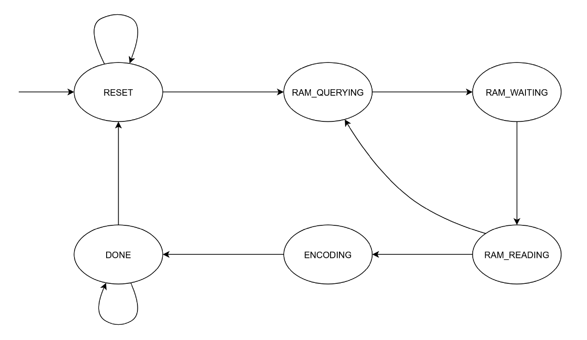
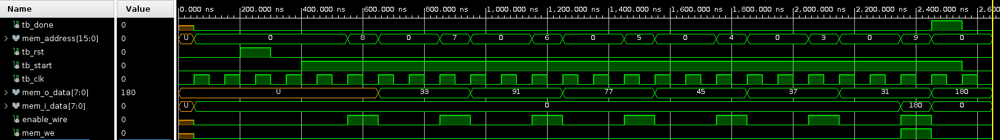
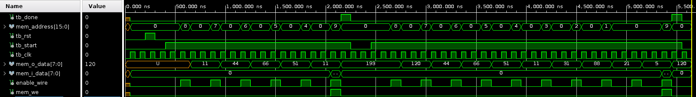
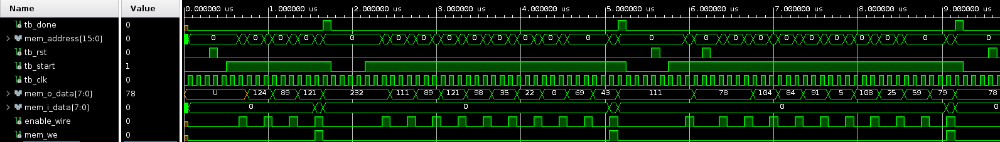

# Working-Zone Encoding - VHDL implementation

Project for the Reti Logiche course at Politecnico di Milano, A.Y. 2019/2020.

## Goal of the project

The goal of this project is to provide a VHDL description of a hardware component which implements an encoding method inspired to the *Working-Zone* one.

You can take a look at the complete [design specification](resources/design_specification.pdf) (in Italian).

## What is Working-Zone Encoding?

Working-Zone Encoding (WZE) is a method for encoding an external address bus of a microprocessor.

It is based on the conjecture that programs favor a few working zones of their
address space at each instant. In such cases, the method identifies these zones and sends through the bus only the offset of this reference with respect to the previous reference to that zone, along with an identifier of the current working zone.

You can find further information about WZE in the [original paper](resources/wze_paper.pdf).

## Implementation

In brief, the hardware component has been implemented as a Finite-State Machine (FSM) with 6 states: *RESET*, *RAM_QUERYING*, *RAM_WAITING*, *RAM_READING*, *ENCODING*, *DONE*.

The behavior of the FSM has been extensively tested through multiple Test Benches in Xilinx Vivado.

For a detailed explanation of my work you can read the final [report](report.pdf) (in Italian).

## Author

- Leonardo Gargani

